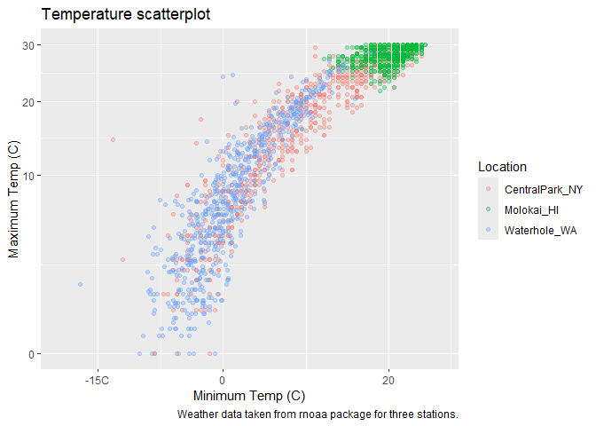
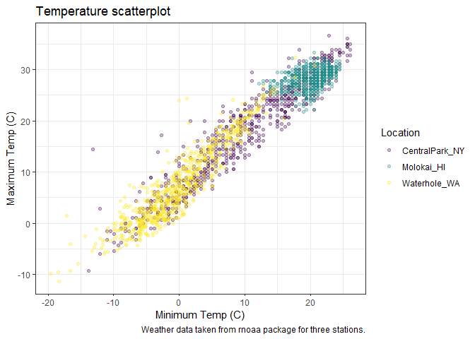
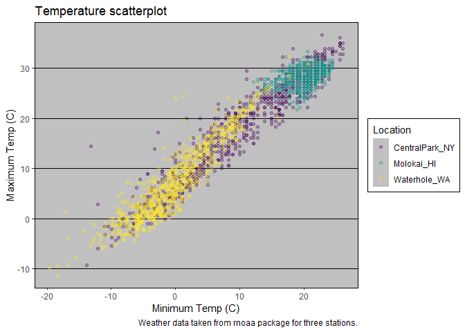
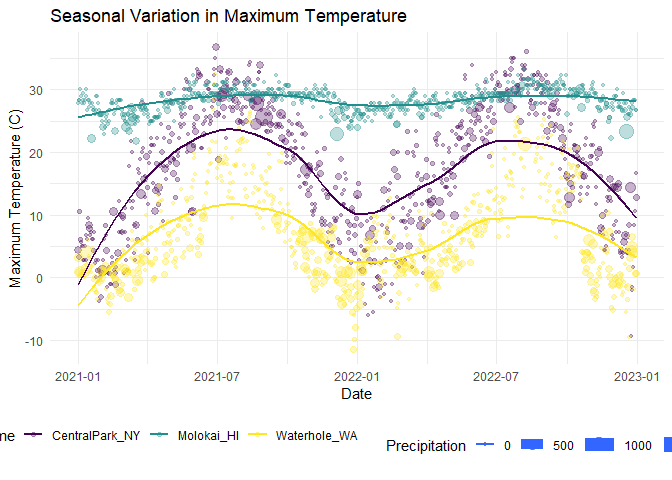
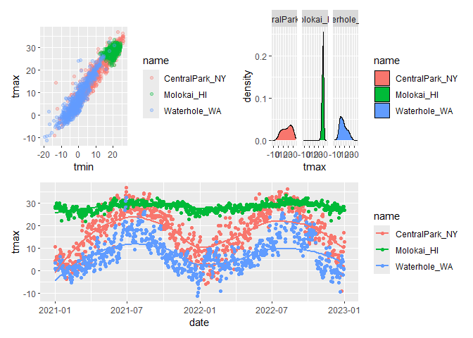

Visualization 2
================

``` r
library(tidyverse)
```

    ## ── Attaching core tidyverse packages ──────────────────────── tidyverse 2.0.0 ──
    ## ✔ dplyr     1.1.4     ✔ readr     2.1.5
    ## ✔ forcats   1.0.0     ✔ stringr   1.5.1
    ## ✔ ggplot2   3.5.1     ✔ tibble    3.2.1
    ## ✔ lubridate 1.9.3     ✔ tidyr     1.3.1
    ## ✔ purrr     1.0.2     
    ## ── Conflicts ────────────────────────────────────────── tidyverse_conflicts() ──
    ## ✖ dplyr::filter() masks stats::filter()
    ## ✖ dplyr::lag()    masks stats::lag()
    ## ℹ Use the conflicted package (<http://conflicted.r-lib.org/>) to force all conflicts to become errors

``` r
library(patchwork)
```

**Importing Data**

``` r
weather_df = 
  rnoaa::meteo_pull_monitors(
    c("USW00094728", "USW00022534", "USS0023B17S"),
    var = c("PRCP", "TMIN", "TMAX"), 
    date_min = "2021-01-01",
    date_max = "2022-12-31") %>% 
  mutate(
    name = case_match(
      id, 
      "USW00094728" ~ "CentralPark_NY", 
      "USW00022534" ~ "Molokai_HI",
      "USS0023B17S" ~ "Waterhole_WA"),
    tmin = tmin / 10,
    tmax = tmax / 10) %>% 
  select(name, id, everything())
```

    ## using cached file: C:\Users\marsi\AppData\Local/R/cache/R/rnoaa/noaa_ghcnd/USW00094728.dly

    ## date created (size, mb): 2024-09-26 10:18:58.392981 (8.668)

    ## file min/max dates: 1869-01-01 / 2024-09-30

    ## using cached file: C:\Users\marsi\AppData\Local/R/cache/R/rnoaa/noaa_ghcnd/USW00022534.dly

    ## date created (size, mb): 2024-09-26 10:19:16.006865 (3.94)

    ## file min/max dates: 1949-10-01 / 2024-09-30

    ## using cached file: C:\Users\marsi\AppData\Local/R/cache/R/rnoaa/noaa_ghcnd/USS0023B17S.dly

    ## date created (size, mb): 2024-09-26 10:19:21.433481 (1.038)

    ## file min/max dates: 1999-09-01 / 2024-09-30

**Make a Scatterplot**

``` r
weather_df %>% 
  ggplot(aes(x = tmin, y = tmax, color = name)) + 
  geom_point(alpha = 0.3) + 
  labs(
    title = "Temperature scatterplot", 
    x = "Minimum Temp (C)", 
    y = "Maximum Temp (C)",
    color = "Location", 
    caption = "Weather data taken from rnoaa package for three stations."
  )
```

    ## Warning: Removed 17 rows containing missing values or values outside the scale range
    ## (`geom_point()`).

<!-- -->

**Scales**

- Start with `x` and `y` and then do `color`

``` r
weather_df %>% 
  ggplot(aes(x = tmin, y = tmax, color = name)) + 
  geom_point(alpha = 0.3) + 
  labs(
    title = "Temperature scatterplot", 
    x = "Minimum Temp (C)", 
    y = "Maximum Temp (C)",
    color = "Location", 
    caption = "Weather data taken from rnoaa package for three stations."
  ) + 
  scale_x_continuous(
    breaks = c(-15,0,20), 
    labels = c("-15C", "0", "20")
  ) + 
  scale_y_continuous(
    limits = c(0,30), 
    transform = "sqrt"
  )
```

    ## Warning in transformation$transform(x): NaNs produced

    ## Warning in scale_y_continuous(limits = c(0, 30), transform = "sqrt"): sqrt
    ## transformation introduced infinite values.

    ## Warning: Removed 302 rows containing missing values or values outside the scale range
    ## (`geom_point()`).

<!-- -->

**Color**

`viridis` package has nice color scales

``` r
ggp_scatterplot <- 
  weather_df %>% 
  ggplot(aes(x = tmin, y = tmax, color = name)) + 
  geom_point(alpha = 0.3) + 
  labs(
    title = "Temperature scatterplot", 
    x = "Minimum Temp (C)", 
    y = "Maximum Temp (C)",
    color = "Location", 
    caption = "Weather data taken from rnoaa package for three stations."
  ) + 
  viridis::scale_color_viridis(discrete = TRUE)
```

**Themes**

``` r
ggp_scatterplot + 
  theme(legend.position = "bottom")
```

    ## Warning: Removed 17 rows containing missing values or values outside the scale range
    ## (`geom_point()`).

<!-- -->

``` r
ggp_scatterplot + 
  theme_bw() + 
  theme(legend.position = "bottom")
```

    ## Warning: Removed 17 rows containing missing values or values outside the scale range
    ## (`geom_point()`).

<!-- -->

- Order Matters

``` r
ggp_scatterplot + 
  theme(legend.position = "bottom") + 
  theme_bw() 
```

    ## Warning: Removed 17 rows containing missing values or values outside the scale range
    ## (`geom_point()`).

<!-- -->

- `Theme_bw()` resets the whole plot, so you have to put them in a
  specific order

``` r
ggp_scatterplot + theme(legend.position = "bottom") + 
  theme_classic()
```

    ## Warning: Removed 17 rows containing missing values or values outside the scale range
    ## (`geom_point()`).

<!-- -->

``` r
ggp_scatterplot + theme(legend.position = "bottom") + 
  ggthemes::theme_excel()
```

    ## Warning: Removed 17 rows containing missing values or values outside the scale range
    ## (`geom_point()`).

<!-- -->

**Learning Assessment**

``` r
weather_df %>% 
  ggplot(aes(x = date, y = tmax, color = name, size = prcp)) + 
  geom_point(alpha = 0.3) + 
  geom_smooth(se = FALSE) +
  labs(
    title = "Seasonal Variation in Maximum Temperature",
    x = "Date", 
    y = "Maximum Temperature (C)", 
    size = "Precipitation"
  ) +
  viridis::scale_color_viridis(discrete = TRUE)  + 
  theme_minimal() +
  theme(legend.position = "bottom") 
```

    ## Warning: Using `size` aesthetic for lines was deprecated in ggplot2 3.4.0.
    ## ℹ Please use `linewidth` instead.
    ## This warning is displayed once every 8 hours.
    ## Call `lifecycle::last_lifecycle_warnings()` to see where this warning was
    ## generated.

    ## `geom_smooth()` using method = 'loess' and formula = 'y ~ x'

    ## Warning: Removed 17 rows containing non-finite outside the scale range
    ## (`stat_smooth()`).

    ## Warning: The following aesthetics were dropped during statistical transformation: size.
    ## ℹ This can happen when ggplot fails to infer the correct grouping structure in
    ##   the data.
    ## ℹ Did you forget to specify a `group` aesthetic or to convert a numerical
    ##   variable into a factor?

    ## Warning: Removed 19 rows containing missing values or values outside the scale range
    ## (`geom_point()`).

<!-- -->

**Bonus `ggplot` Features**

- Use different data sets in different `geoms`

``` r
central_park_df <- 
  weather_df %>% 
  filter(name == "CentralPark_NY")

molokai_df <- 
  weather_df %>% 
  filter(name == "Molokai_HI")

molokai_df %>% 
  ggplot(aes(x = date, y = tmax, color = name)) + 
  geom_point() + 
  geom_line(data = central_park_df)
```

    ## Warning: Removed 1 row containing missing values or values outside the scale range
    ## (`geom_point()`).

<!-- -->

## Multiple Panels

``` r
weather_df %>% 
  ggplot(aes(x = tmax, fill = name)) + 
  geom_density() + 
  facet_grid(.~name)
```

    ## Warning: Removed 17 rows containing non-finite outside the scale range
    ## (`stat_density()`).

<!-- -->

``` r
ggp_tmax_tmin <- 
  weather_df %>% 
  ggplot(aes(x = tmin, y = tmax, color = name)) + 
  geom_point(alpha = 0.3)

ggp_tmax_density <- 
  weather_df %>% 
  ggplot(aes(x = tmax, fill = name)) + 
  geom_density() + 
  facet_grid(.~name)

ggp_tmax_date <- 
  weather_df %>% 
  ggplot(aes(x = date, y = tmax, color = name)) + 
  geom_point() + 
  geom_smooth(se = FALSE)

(ggp_tmax_tmin + ggp_tmax_density) / ggp_tmax_date
```

    ## Warning: Removed 17 rows containing missing values or values outside the scale range
    ## (`geom_point()`).

    ## Warning: Removed 17 rows containing non-finite outside the scale range
    ## (`stat_density()`).

    ## `geom_smooth()` using method = 'loess' and formula = 'y ~ x'

    ## Warning: Removed 17 rows containing non-finite outside the scale range
    ## (`stat_smooth()`).

    ## Warning: Removed 17 rows containing missing values or values outside the scale range
    ## (`geom_point()`).

<!-- -->
